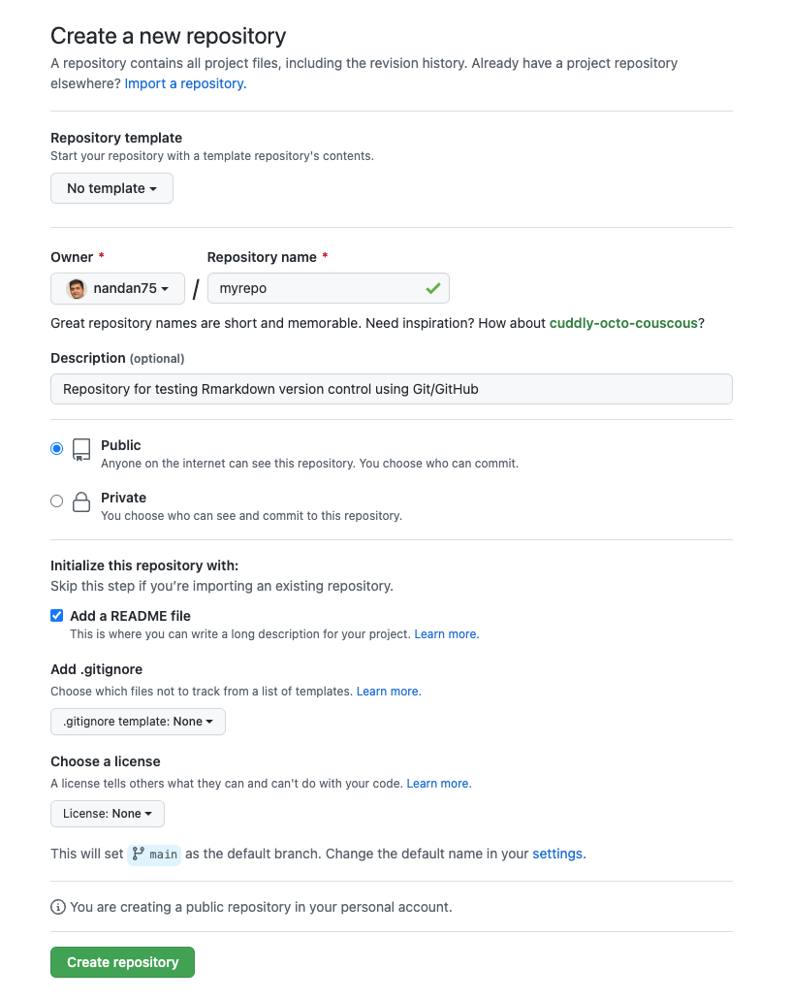
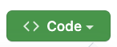
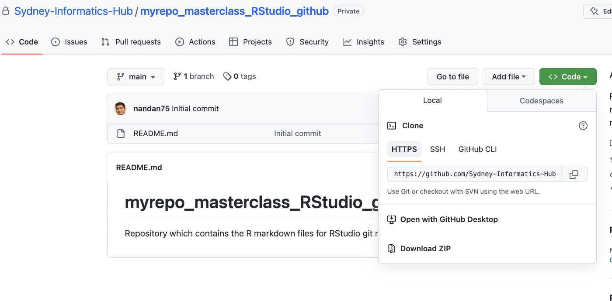

# **Is git connected to github?**

<div class="questions">

### **Questions** {.unlisted}
* Can you connect git and a remote git server such as github?
</div>
You need to confirm that you can clone a repository from GitHub and establish two-way communications between the local git and the github - This is called  `pull` and `push`.

When communicating with a remote server, git has two available protocols - HTTPS and SSH - each of which requires different credentials.

We will discuss how you can setup your credentials for the HTTPs protocol.

### **Personal access token for HTTPS**
* Personal access token (PAT) is required by a remote git server such as github to confirm a users credentials.
* **Please note** that the password that you used to log in to GitHub's website cannot be used as a valid credential for communicating with GitHub as a Git server (anymore).  

These are the steps which you need to follow to generate a PAT
<br>* Go to [https://github.com/settings/tokens](https://github.com/settings/tokens)  and click “Generate token”.
<br>* In the form select “repo”, “user”, and “workflow” and click on “Generate token”.
<br>* Please copy the generated PAT to your clipboard. You will need it the next time when a git operation asks for your password.


### **Connect to gitHub, create and download a repository**
Have you logged in to `https://github.com/`?
<br> Once you have logged-in, follow the steps as shown below to create a new repository called 'myrepo'


<br>* Click on the `+` symbol on the right hand top corner.
<br>* Select `New repository`




Please select the following options in the above form. 
<br>* **Repository template**: No template.
<br>* **Repository name**: myrepo or any other name of your choice.
<br>* **Description**: “Repository for testing my Git/GitHub setup” or similar. 
<br>* Choose `Public`.
<br>* Initialize this repository with: Add a README file.
<br>* Click the big green button that says “Create repository”.

Now click the big green button that says 

Copy the clone URL to your clipboard. Since we have created a PAT for HTTPS protocol , copy the HTTPS URL as shown below.




`git clone https://github.com/YOUR-USERNAME/YOUR-REPOSITORY.git`

```default
~/master_class % git clone https://github.com/Sydney-Informatics-Hub/myrepo_masterclass_RStudio_github.git 
Cloning into 'myrepo_masterclass_RStudio_github'...
Username for 'https://github.com': nandan75
Password for 'https://nandan75@github.com': 
remote: Enumerating objects: 3, done.
remote: Counting objects: 100% (3/3), done.
remote: Compressing objects: 100% (2/2), done.
remote: Total 3 (delta 0), reused 0 (delta 0), pack-reused 0
Receiving objects: 100% (3/3), done.
```

I have named my repo as `myrepo_masterclass_RStudio_github'
Please do a few checks with the local copy of the repos

Make this new repo your working directory, list its files, display the README, and get some information on its connection to GitHub:

* Make this new repo your working directory
`cd myrepo_masterclass_RStudio_github`
* list all files
`ls`
* Display the README
`head README.md`
* Get some information on its connection to GitHub
`git remote show origin`


### **Make a local change, then commit, and push**
Add a line to README and verify that git notices the change:

```default
echo " I am adding a line in my local copy  " >> README.md
git status
```

```default
On branch main
Your branch is up to date with 'origin/main'.

Changes not staged for commit:
  (use "git add <file>..." to update what will be committed)
  (use "git restore <file>..." to discard changes in working directory)
	modified:   README.md

no changes added to commit (use "git add" and/or "git commit -a")
```

Add the file with changes - README.md for commit step
`git add README.md`


```default
git commit -m "A commit from my local computer"`
[main 306de6f] A commit from my local computer
 1 file changed, 1 insertion(+)
```

Push the changes to github 
`git push`

The local changes should now be reflectd into the `README.md` file on the github repo. Please check them.

<div class="keypoints">

### **Key points** {.unlisted}
If you’re a new GitHub user and using HTTPS, you might be asked for your username and password. 
<br>**Note** Use you PAT and not your login password.

</div>  


  
