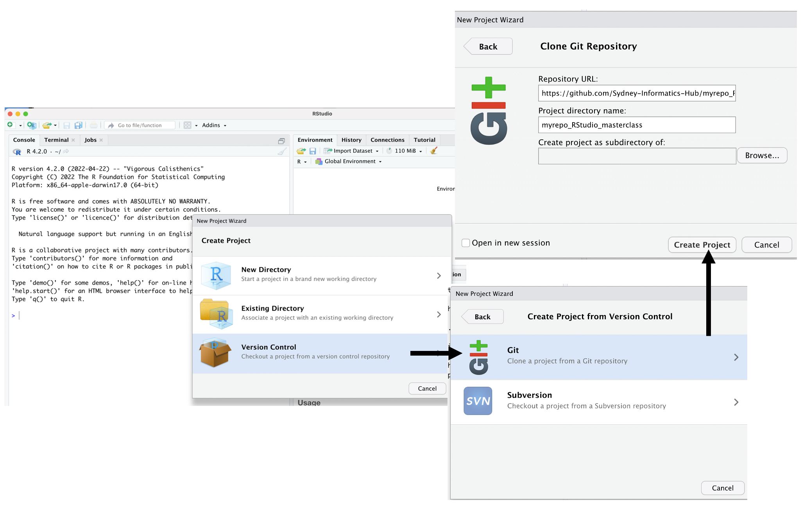

# **Clone the test GitHub repository to your computer using RStudio**

### **Questions** {.unlisted}
* Are you ready to check RStudio and github connectivity?

 

In RStudio, start a new Project:

* `File > New Project > Version Control > Git`. 
 In “Repository URL”, paste the URL of your new GitHub repository. It will be something like this `https://github.com/Sydney-Informatics-Hub/myrepo_masterclass_RStudio_github.git`.
* Accept the default project directory name, e.g. myrepo, which coincides with the GitHub repo name.
* Keep a note of where the Project will be saved locally. 
* Check “Open in new session”.
* Click “Create Project”.
* You should find yourself in a new local RStudio Project that represents your test repo on GitHub. This should download the README.md file from GitHub. Look in RStudio’s file browser pane for the README.md file.

### **Key points** {.unlisted}

  

  
