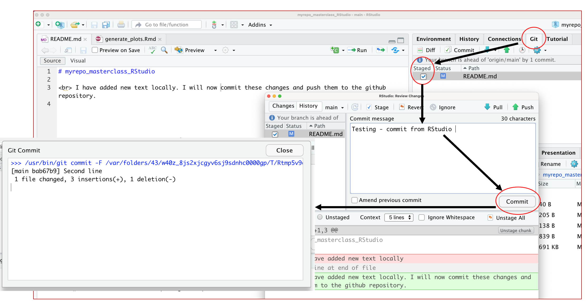
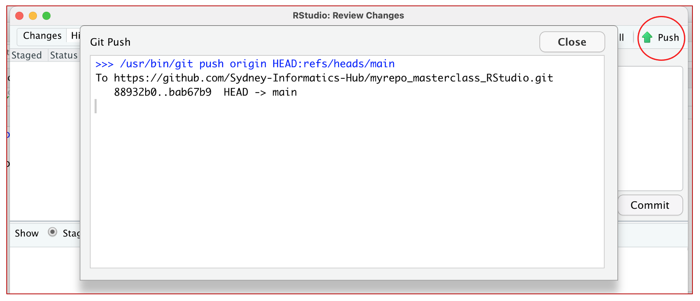

# **Make local changes, save, commit**

### **Questions** {.unlisted}
* How to use RStudio to push local changes to github?

 

### **Make local changes, save, commit**

In our project, we can perform to independant tasks

(1) In RStudio, click on the README.md file, and edit it e.g., by adding the line “This is a line from RStudio”. 
Save your changes.Commit these changes to your local repo. 

How do you do that?
 In RStudio:

* Click the “Git” tab in upper right pane.
* Check “Staged” box for README.md.
* If you’re not already in the Git pop-up, click “Commit”.
* Type a message in “Commit message”, such as “Commit from RStudio”.
* Click “Commit”.

### **Push your local changes online to GitHub**
Click the green arrow “Push” button to send your local changes to GitHub.

Ideally you should not experience any isuse when pushing the changes to the github server as you have previously done similar push from the command line - on the Setup page [Is git connected to github?](http://localhost:5411/notebooks/Connections.html#make-a-local-change-then-commit-and-push). 

The RStudio’s Git pane provides a specific subset of command line Git though its interface. So, if your credentials work in the shell, they should work in RStudio. If you do experience a problem here, you can contact us after the session by email and we can discuss.

### Confirm the local change propagated to the GitHub remote
Go back to the browser. I assume we’re still viewing your new GitHub repo.

Refresh.

You should see the new “This is a line from RStudio” in the README.

If you click on “commits”, you should see one with the message “Commit from RStudio”.

If you have made it this far, Congratulations! You have been successful in backing up chamges on you local machine using RStudio to the GitHub server.

(2) Since we primarily work with Rmarkdown files when using RStudio, we can try and repeat the above steps for a Rmarkdown file.
Please follow the following steps.
* In RStudio 
   `File -> New File -> R Markdown`
* The Rmarkdown file contans default code to generate some plots.
* Once you create a new file, this change can be directly pushed to the GitHub repo by repeating the above steps.
* And/or you can modify the script as per your requirement and then proceed to `push` and `commit` using the options avaiable in the “Git” tab in upper right pane of the RStudio.  

### **Key points** {.unlisted}

  

  
