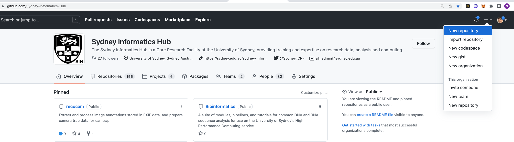
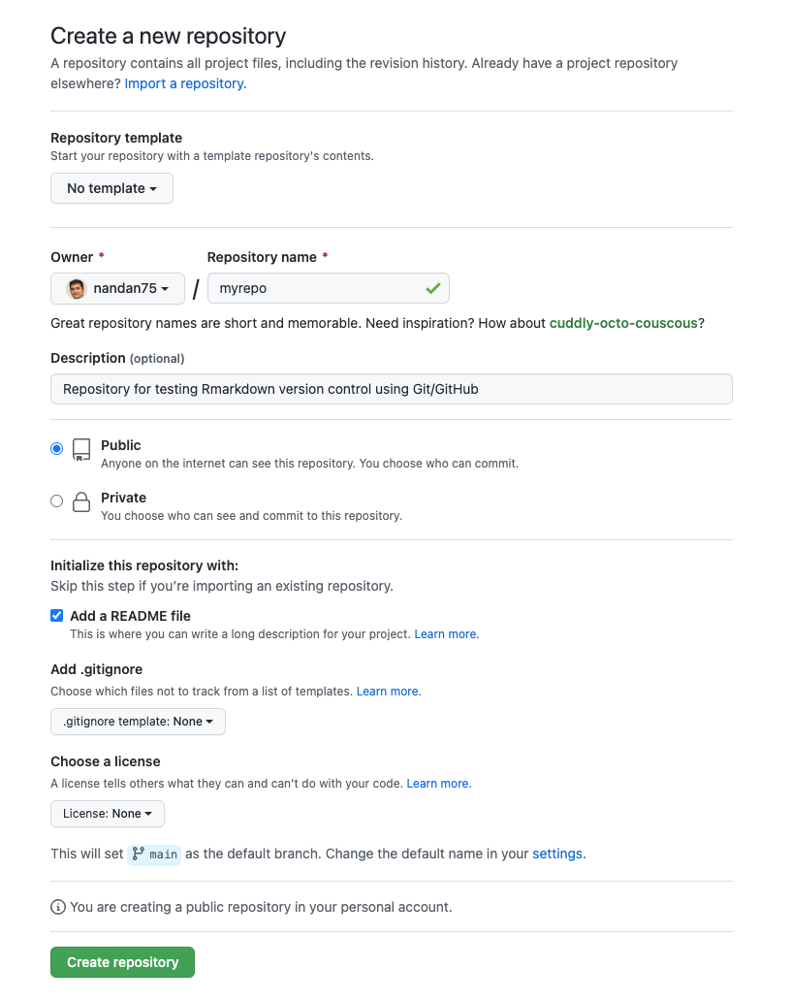
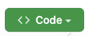
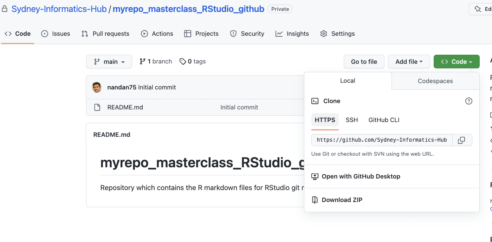

# **Create a new repository on GitHub**

### **Questions** {.unlisted}
* Are you ready? Are all the pre-requisites satisfied?

 

* For todays code-along session, you will need a test repository (or repo) on GitHub. 
* If you have previously created a repo on github by following the instructions during `setup` , that repo will work well! However, we encourage you to delete that repo, so you can experience how to use RStudio to clone it and get a local copy. 
* The repo is just a regular directory on your computer. You can delete this directory which corresponds to the local repo using command such as `rm -r myrepo` on command line. 

Re-create a new repository called 'myrepo'

 * Click on the `+` symbol on the right hand top corner.
 * Select `New repository`

Please select the following options in the above form. 
 * **Repository template**: No template.
 * **Repository name**: myrepo or any other name of your choice.
 * **Description**: “Repository for testing my Git/GitHub setup” or similar. 
 * Choose `Public`.
 * Initialize this repository with: Add a README file.
 * Click the big green button that says “Create repository”.

Now click the big green button that says 

Copy the clone URL to your clipboard. Since we have created a PAT for HTTPS protocol , copy the HTTPS URL as shown below.

### **Key points** {.unlisted}

  

  
